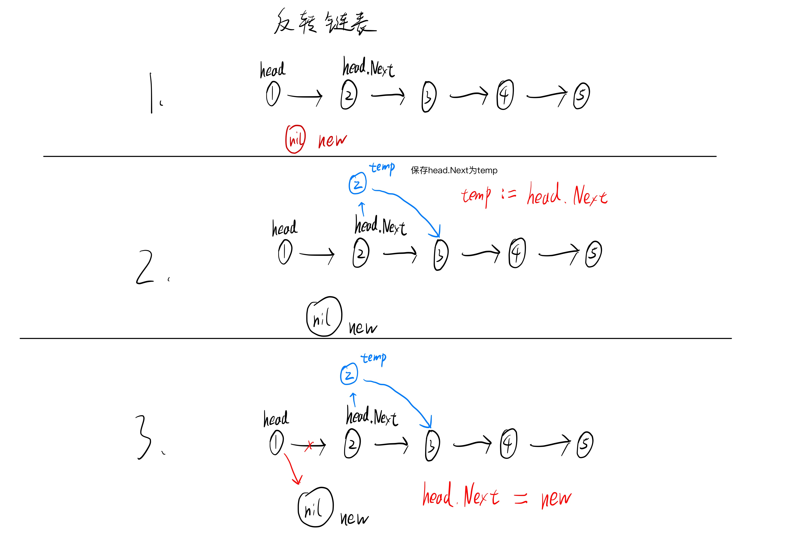
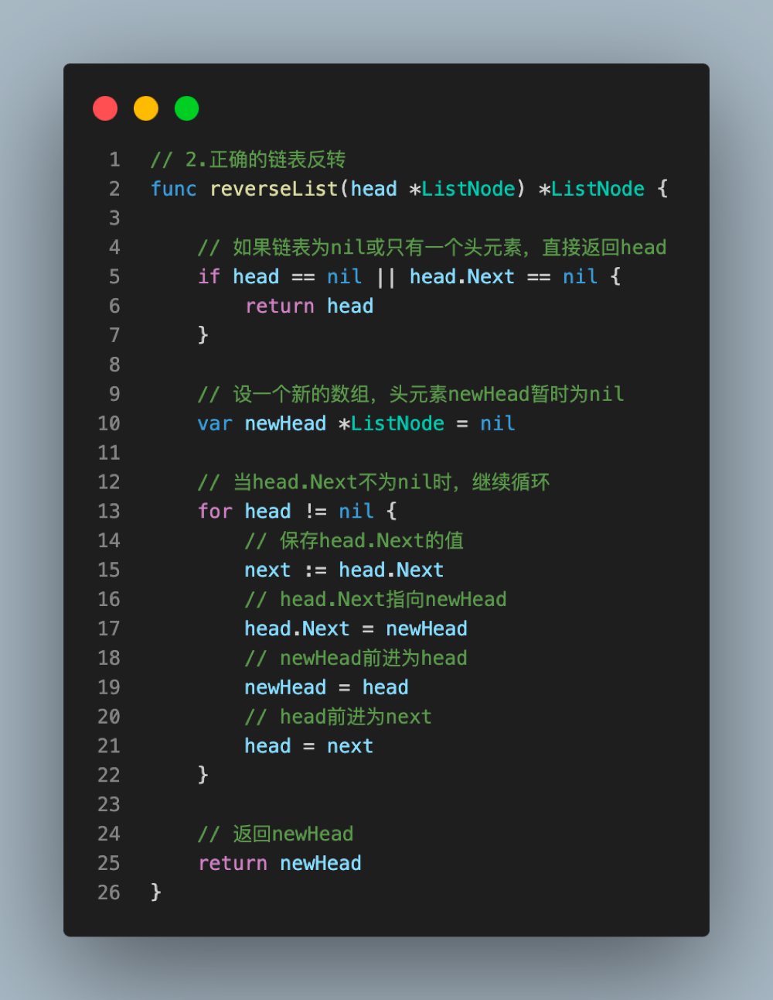

# 206. Reverse Linked List（反转链表）

Easy

Given the head of a singly linked list, reverse the list, and return the reversed list.

Example 1:

> Input: head = [1,2,3,4,5]
Output: [5,4,3,2,1]

Example 2:

> Input: head = [1,2]
Output: [2,1]

Example 3:
> Input: head = []
Output: []
 

Constraints:

The number of nodes in the list is the range [0, 5000].
-5000 <= Node.val <= 5000
 

Follow up: A linked list can be reversed either iteratively or recursively. Could you implement both?

---

## 解题思路

> 1. 定义一个新的链表，头节点为new，初始化为nil
> 2. 把当前链表的head节点的下一个节点head.Next保存给临时变量temp，方便之后head转移为head.Next。
> 3. head.Next指向new，即head.Next = new，这样head节点就从原链表中脱离出来，接入到新链表中。
 
> 4. 把这里的head变成new，即new = head，这样new就还是新链表的头节点。
> 5. 把head变成temp，即head = temp，等于开启了下一轮的循环。原本的head节点已经接入到新链表中。
 
> 6. 重复2-5步骤，直到head为nil，即原链表的尾节点。



---

## 代码实现

```go
package main

import "fmt"

func main() {
	head := &ListNode{Val: 1}
	head.Next = &ListNode{Val: 2}
	head.Next.Next = &ListNode{Val: 3}
	head.Next.Next.Next = &ListNode{Val: 4}
	head.Next.Next.Next.Next = &ListNode{Val: 5}
	printLinnkedList(head)
	res := reverseList(head)
	printLinnkedList(res)
}

type ListNode struct {
	Val  int
	Next *ListNode
}

// 1.对调linkNode的值Val
// 没有真正改变链表的链接结构，只重新分配了值
func reverseList1(head *ListNode) *ListNode {

	// 如果链表为nil或只有一个头元素，直接返回head
	if head == nil || head.Next == nil {
		return head
	}

	// 两个指针，一个用于遍历链表得到每个元素的值，一个用于修改链表里每个元素的值
	var temp1 *ListNode = head
	var temp2 *ListNode = head

	// 用于存储链表的值
	var arr []int

	// 遍历链表，将链表的值存储到arr数组中
	for temp1 != nil {
		arr = append(arr, temp1.Val)
		temp1 = temp1.Next
	}

	// 第二次从头遍历链表，将arr数组的值倒序赋值给链表
	count := len(arr) - 1
	for temp2 != nil {
		temp2.Val = arr[count]
		count -= 1
		temp2 = temp2.Next
	}

	// 返回修改值后的原链表
	return head
}

// =======================================================================================================================
// 2.正确的链表反转
func reverseList(head *ListNode) *ListNode {

	// 如果链表为nil或只有一个头元素，直接返回head
	if head == nil || head.Next == nil {
		return head
	}

	// 设一个新的数组，头元素newHead暂时为nil
	var newHead *ListNode = nil

	// 当head.Next不为nil时，继续循环
	for head != nil {
		// 保存head.Next的值
		next := head.Next
		// head.Next指向newHead
		head.Next = newHead
		// newHead前进为head
		newHead = head
		// head前进为next
		head = next
	}

	// 返回newHead
	return newHead
}

// =======================================================================================================================
// 打印链表方法
func printLinnkedList(head *ListNode) {
	var res []int
	for head != nil {
		res = append(res, head.Val)
		head = head.Next
	}
	fmt.Println(res)
}
```